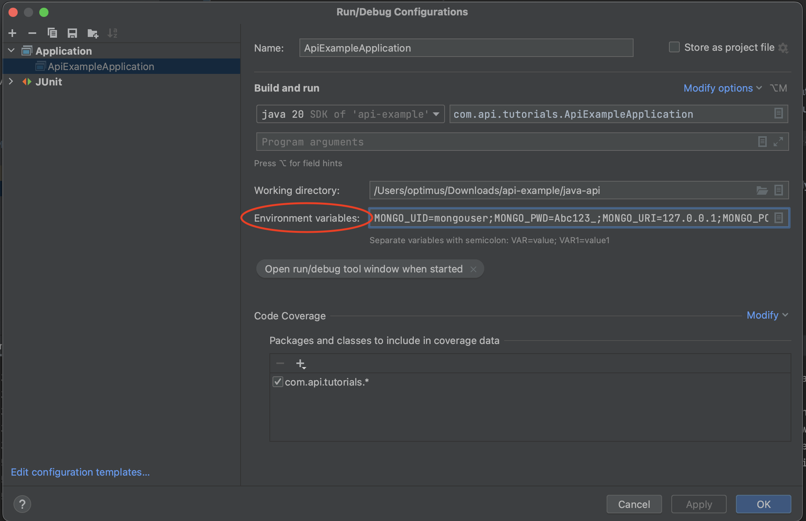
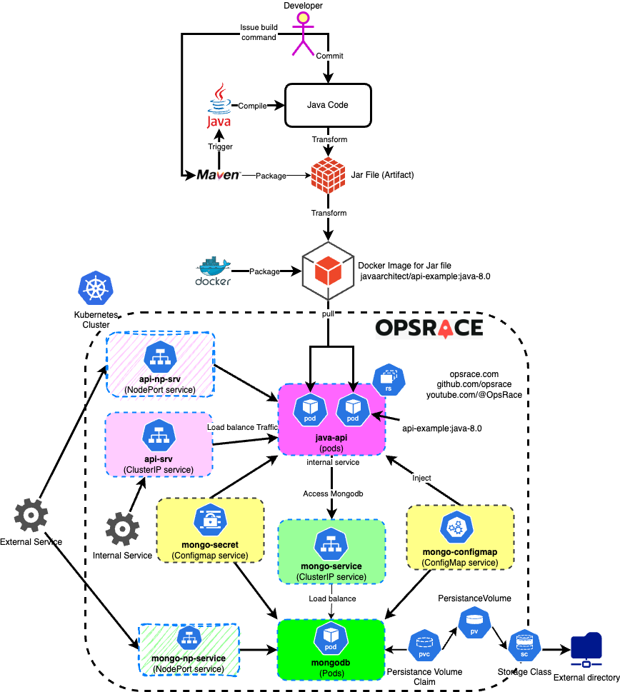

# Java REST API Example
This is a sample project to demonstrate REST API, the real REST API and its misconception, standards and work aounds
Video lectures that cover basics can be found here
https://www.youtube.com/watch?v=4eULIqvtM9M&list=PL583g8pkjwgmiZnrLkFwgAh9KPPd-MsvQ

It covers the topic like
* What is REST API?
* What exactly is REST API?
* How protocol Work (A beginner level definitions)
* How HTTP work and how it impacts REST APIs
* Session
* HTTP Status codes
* HTTP Methods
* Security
* and many more


# Running Application
This application expect couple of environment variable to connect to database, if you are using eclipse you can use pass following
"Environment variables" through "Run configuration"

`MONGO_UID=mongouser;MONGO_PWD=Abc123_;MONGO_URI=127.0.0.1;MONGO_PORT=53667;MONGO_DB=cars`

If you run it through k8 deployment yaml then these will be automatically passed to spring boot application



## Build Artifact(Jar file)
`cd java-api`

`mvn clean package`

## Build docker image
`docker build -t api-example:java-8.0 .`


## Docker Deployment
### Run MongoDB as docker
`docker run -p 27017:27017 -d -e MONGO_INITDB_ROOT_USERNAME=admin -e MONGO_INITDB_ROOT_PASSWORD=password --name mongodb-x --network=demo-network mongo`

`docker logs 311a0ea3bd0ff79920e7caf05786aa35253eb203db07a42f076e18b497fdb188`

### Run Mongo-Express

```
docker run -d -p 8081:8081 \
    -e ME_CONFIG_MONGODB_ADMINUSERNAME=admin \
    -e ME_CONFIG_MONGODB_ADMINPASSWORD=password \
    -e ME_CONFIG_MONGODB_SERVER=mongodb-x \
    --network demo-network \
    --name demo-express \
    mongo-express
```

### Run Java Service to connect to MongoDB
```
docker run -p 8099:8080 --network=demo-network \
    -e MONGO_UID=admin \
    -e MONGO_PWD=password \
    -e MONGO_URI=mongodb-x \
    -e MONGO_PORT=27017 \
    -e MONGO_DB=cars \
    api-example:java-8.0
```
### Persist data changes (Volumes)
We need to persist the records for each execution

`docker volume create --name local-mongo`

Now mount it in the docker container, you have to stop previous one and remove as it will use same name

```
docker run -p 27017:27017 -d \
    -e MONGO_INITDB_ROOT_USERNAME=admin \
    -e MONGO_INITDB_ROOT_PASSWORD=password \
    --name mongodb-x \
    --network=demo-network \
    -v local-mongo:/data/db \
    mongo
```

You can relaunch the java api container it may have broken when we restarted the mongodb with volume


## Run everything with Docker Compose
Stop all containers and remove everything, use following command to setup with the help of docker-compose

#### Up everything
`docker-compose -f docker-compose.yaml up`

`Ctl+C`

#### Down everything

`docker-compose -f docker-compose.yaml down`


You may experience some issues if some of the dependant containers are not up

## Kubernetes deployment


### The deployment architecture


### Build Artifact(Jar file)
`cd java-api`

`mvn clean package`

### Build docker image
`docker build -t api-example:java-8.0 .`

### (Re)Tag docker image
`docker tag api-example:java-8.0 javaarchitect/api-example:java-8.0`
`docker push javaarchitect/api-example:java-8.0`

### Apply K8 changes
Image must have been built and pushed to respective repository

`cd k8`

```
kubectl apply -f mongo-configmap.yaml
kubectl apply -f mongo-secret.yaml
kubectl apply -f mongo-deployment.yaml
kubectl apply -f mongo-express-deployment.yaml
```
MongoDB Express will keep waiting for external up address, but as this is minikube hence we need to run a special comamnd to get the ip address

`minikube service mongo-express-service`

The above command will open a URL automatically that is used to access `Mongo Express`

Express username is `admin` and password is `pass`


### Get container shell access
`docker exec -it containerId /bin/sh`

## Not important
Get into docker linux

`screen ~/Library/Containers/com.docker.docker/Data/com.docker.driver.amd64-linux/tty`

An alternate way to get into Docker linux virtual machine on macbook

`docker run -it --privileged --pid=host debian nsenter -t 1 -m -u -n -i sh`


kubectl expose deployment mongodb-x --type=NodePort --name=mongo-np-service --port=27017 --target-port=27017 --node-port=30001
mongo-np-service